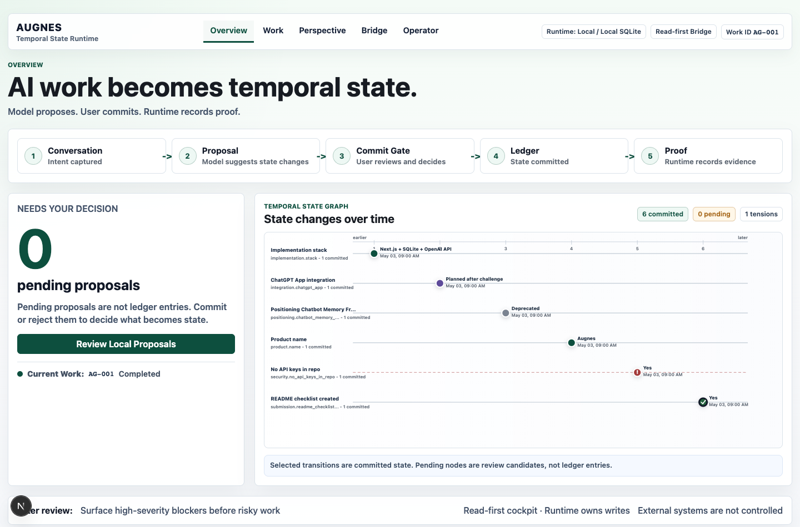
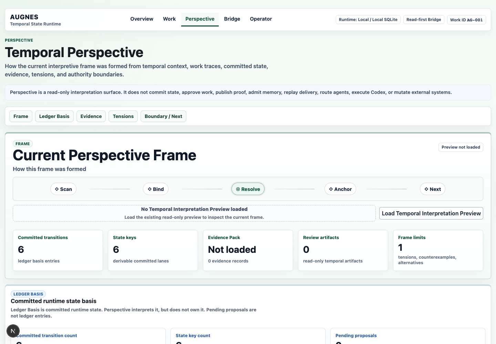
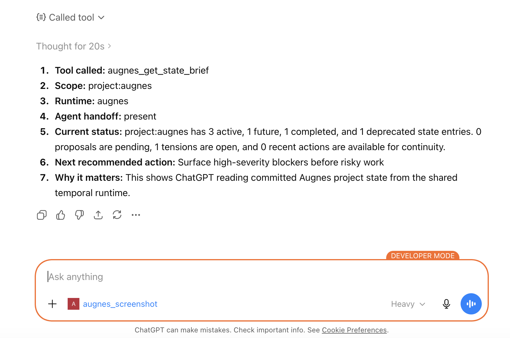
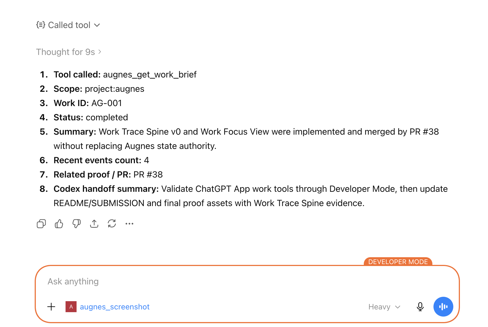
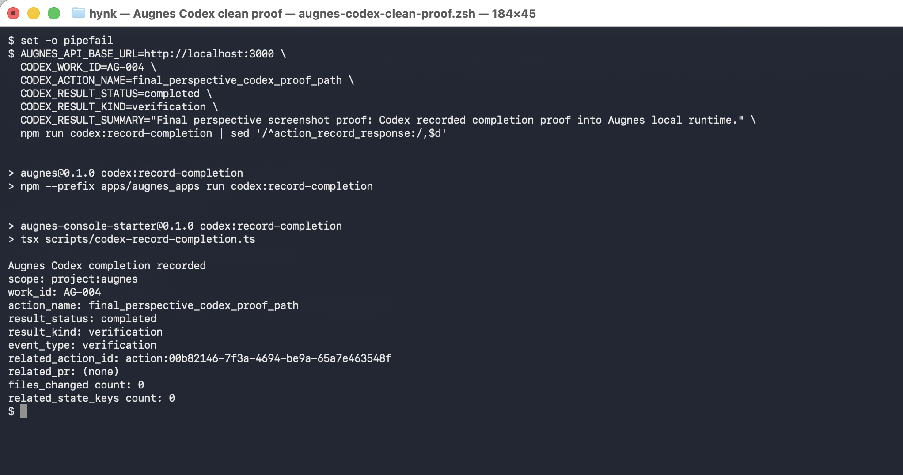

# Augnes

> **Status:** Augnes is under active Augnes-on-Augnes dogfooding.
> We use Augnes itself to plan, hand off, review, and refine Augnes development,
> continuously improving its temporal perspective, cross-session continuity, and
> practical usability.

## What it is

Augnes is a local runtime for AI-assisted project work. It keeps proposed
changes, accepted state, work traces, and proof records in one place so ChatGPT
Apps, MCP clients, Codex, and the Cockpit can work from the same committed
state.

OpenAI output is used to draft interpretations and proposals, but it is not
stored as durable project state on its own. Augnes records accepted transitions
in SQLite, keeps commit/reject decisions behind a user/runtime gate, and links
work to `AG-xxx` trace IDs.

Cockpit is the local UI for reviewing state, work, bridge activity, and local
proposal decisions. ChatGPT App / MCP tools provide read-first bridge access.
Codex can record implementation results, evidence, and work trace notes. Each
surface reads from or records back to the same runtime-owned state.

## Why it exists

AI-assisted project work often gets split across chat memory, local code
changes, GitHub history, screenshots, and human handoffs. ChatGPT can plan and
review, Codex can implement and test, and GitHub can store the code, but the
current project state can still live in the operator's head.

Augnes gives that work a shared local record: committed state, work trace
anchors, and proof records. Models can help interpret and propose changes, while
the runtime and the user keep control over what becomes durable state.

## What it does

- Compiles natural language into typed temporal state delta proposals.
- Keeps committed state behind an explicit commit/reject gate.
- Stores accepted transitions in a local SQLite ledger and renders them in a
  Temporal State Graph.
- Shows State Snapshot, Current Work, and `/api/state/brief` / `agent_handoff`
  views for external-agent continuity.
- Uses Work IDs and Work Trace Spine views to anchor AG-xxx task context.
- Provides a five-tab Cockpit operator UI: Overview, Work, Perspective,
  Bridge, and Operator. Perspective contains Ledger Basis, Evidence, Tensions,
  and Boundary / Next sections.
- Exposes MCP / ChatGPT App bridge tools for read-first state access and gated
  proof recording.
- Includes Codex handoff, completion, evidence, and session helper scripts.
- Provides a read-only Temporal Interpretation Preview for structured
  project-context interpretation.

## How it uses OpenAI APIs

OpenAI APIs are used for interpretation, planning, and preview generation, not
direct mutation of durable state.

- `POST /api/observe` uses the OpenAI Responses API to compile natural language
  into typed temporal state delta proposals when `OPENAI_API_KEY` is set.
- `POST /api/plan` uses committed Augnes state to generate grounded
  next-action recommendations when `OPENAI_API_KEY` is set.
- `POST /api/temporal-interpretation/preview` uses OpenAI to generate a
  read-only temporal interpretation preview when `OPENAI_API_KEY` is set.
- Deterministic mock fallbacks keep the local demo runnable when
  `OPENAI_API_KEY` is unset.

The runtime validates model output before saving proposals. Only accepted
transitions become committed state.

## Quick start

Run the local runtime:

```bash
npm install
npm run db:reset
npm run db:migrate
npm run demo:seed
env -u OPENAI_API_KEY AUGNES_DB_PATH=/tmp/augnes-demo.db npm run dev -- --port 3000
```

Then open:

```text
http://localhost:3000
```

`OPENAI_API_KEY` is optional for the local demo because deterministic mock
fallbacks are included. To test OpenAI-backed observe, plan, and preview flows,
set `OPENAI_API_KEY` in your local environment. Do not commit `.env` or
`.env.local`.

## Bridge proof

Start the MCP / ChatGPT App bridge in a second terminal:

```bash
npm --prefix apps/augnes_apps install
AUGNES_ENABLE_AGENT_BRIDGE=true AUGNES_API_BASE_URL=http://localhost:3000 npm --prefix apps/augnes_apps run dev
```

The bridge listens at:

```text
http://localhost:8787/mcp
```

With MCP Inspector, run `augnes_get_state_brief` for `project:augnes`, then run
`augnes_record_action_result` with a safe proof action. The committed graph node
shows that an external MCP-compatible client read Augnes state and recorded an
action result back into the runtime without gaining commit/reject authority.

### ChatGPT App / Developer Mode use

After the bridge is running, connect ChatGPT Developer Mode or any
MCP-compatible client to:

```text
http://localhost:8787/mcp
```

Useful calls:

- `augnes_get_state_brief` with args `{ "scope": "project:augnes" }`
- `augnes_get_work_brief` with args `{ "scope": "project:augnes", "work_id": "AG-001" }`

These calls let ChatGPT read committed Augnes project state, `agent_handoff`,
work status, proof links, and Codex handoff context without receiving
commit/reject authority.

For Codex-side usage, see the [Codex Session Adapter workflow](docs/CODEX_SESSION_ADAPTER_V0_2_WORKFLOW.md),
which covers `codex:read-brief`, `codex:record-evidence`, and the preferred
proof-only `codex:record-completion-proof` closeout path through
`/api/actions/record-proof`.
`codex:record-completion` remains legacy compatibility behavior and may use
`/api/actions/record` to create legacy `external.*` marker state. Successful
legacy writes emit a stderr compatibility warning, and compatibility migration
remains unresolved. `codex:record-result` is the lower-level legacy
compatibility helper for direct action-record writes, not the normal Codex
closeout path.

## Screenshots

### Cockpit

| Cockpit Overview | Perspective-centered IA |
|---|---|
|  |  |

### AI surfaces using Augnes

| ChatGPT state brief | ChatGPT work brief | Codex completion proof |
|---|---|---|
|  |  |  |

More screenshots and supporting proof captures are listed in [screenshots/README.md](screenshots/README.md).

## Demo flow

1. Run the quick-start commands and open the Cockpit.
2. Review the Overview tab and Temporal State Graph.
3. Open Work to see AG-xxx Work Focus / Trace Spine context.
4. Open Perspective to inspect the current frame, Ledger Basis, Evidence,
   Tensions, and Boundary / Next.
5. Open Bridge to review read-first / no direct external-control boundaries.
6. Open Operator to see safe local runtime controls.
7. Fetch the state brief and inspect `agent_handoff`:

```bash
curl -sS 'http://localhost:3000/api/state/brief?scope=project:augnes' | jq '.agent_handoff'
```

8. Start the MCP bridge and verify state brief + action record proof through
   MCP Inspector.

## Augnes-on-Augnes evaluation

The repo-local dogfooding docs are:

- [Augnes dogfooding research direction](docs/AUGNES_DOGFOODING_RESEARCH_DIRECTION_V0_1.md)
- [Raw episode capture](docs/RAW_EPISODE_CAPTURE_V0_1.md)
- [Dogfooding episode log](docs/DOGFOODING_EPISODE_LOG_V0_1.md)
- [Dogfooding evaluation criteria](docs/DOGFOODING_EVALUATION_CRITERIA_V0_1.md)

For an independent dogfood report, keep outputs in bounded repo-local paths:

- `reports/dogfood/<date>-<run-id>.md`
- `reports/dogfood/<date>-<index-or-summary>.md`
- `backlog/augnes-friction-backlog.md`
- `backlog/augnes-improvement-proposals.md`

Dogfood notes are research and evaluation guidance only. They do not change
runtime behavior, DB schema, API routes, bridge tools, Cockpit controls, or
authority boundaries.

## Security and boundaries

- No API keys are committed. `.env` and `.env*.local` are ignored.
- Augnes is local-first and is not a hosted production deployment.
- Production auth, OAuth, and multi-user support are intentionally out of
  scope for this challenge build.
- The model does not directly mutate durable state.
- Commit/reject authority remains user/runtime gated.
- The bridge remains read-first plus gated proof recording.
- Work IDs are trace anchors, not state authority.
- Action records are execution proof.
- GitHub App installation-token exchange remains future/design-boundary work;
  this repo does not implement a live GitHub App token provider.

## Limitations

- The app is a local challenge build, not a hosted service.
- The bridge proof uses local MCP / Inspector workflows.
- OpenAI-backed flows require a locally supplied `OPENAI_API_KEY`.
- Mock fallbacks are deterministic and useful for demos, but they are not a
  replacement for evaluating OpenAI-backed behavior.
- The runtime is single-operator/local-first and does not implement production
  auth or multi-user collaboration.

## Deep docs

- [Cockpit Perspective IA](docs/COCKPIT_PERSPECTIVE_IA_V0_1.md)
- [Codex Session Adapter workflow](docs/CODEX_SESSION_ADAPTER_V0_2_WORKFLOW.md)
- [Evidence Pack / verification evidence](docs/VERIFICATION_EVIDENCE_PACK.md)
- [Authority matrix](docs/AUTHORITY_MATRIX.md)
- [Dogfooding evaluation criteria](docs/DOGFOODING_EVALUATION_CRITERIA_V0_1.md)
- [Raw episode capture](docs/RAW_EPISODE_CAPTURE_V0_1.md)
- [Latest docs index](docs/00_INDEX_LATEST.md)
