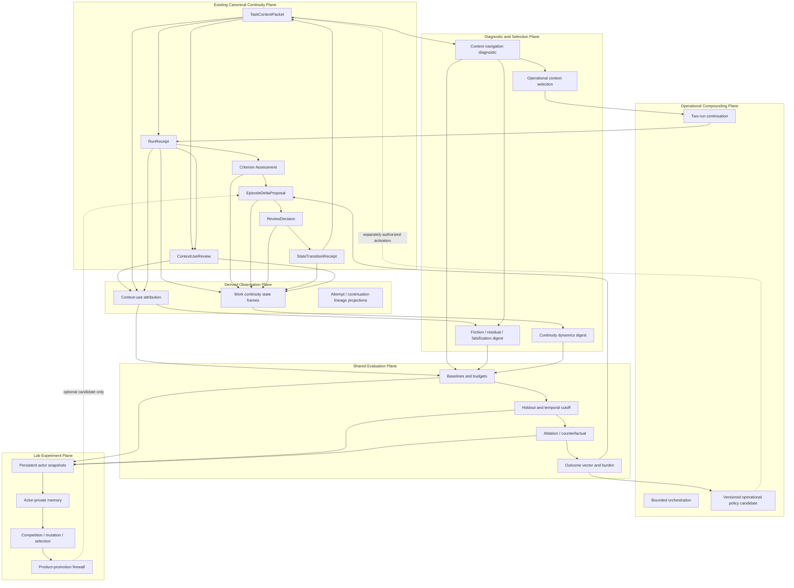

# Augnes Adaptive Continuity and Governed Compounding R&D Program v0.1
## Context attribution, temporal dynamics, model succession, cross-run continuation, strategy composition, and gated actor evolution

> **문서 지위:** 조건부 통합 R&D 설계·로드맵 제안 / 구현 미승인 / 비권위적
>
> **대상 저장소:** `hynk-studio/augnes-perspective-lab`
>
> **검토 기준:** `main@3776e10d30fd9fc7e5f44255e32369131a031a56`
>
> **GitHub 상태 관찰일:** 2026-08-11 KST
>
> **개정 상태:** Stage 0 착수용 repo-fit 최종본 — PC6 parent closeout 이후와 CDX2B3B final cross-platform regression 대기 상태를 반영
>
> **권장 저장 경로:** `docs/vnext/research/AUGNES_ADAPTIVE_CONTINUITY_AND_GOVERNED_COMPOUNDING_RND_PROGRAM_V0_1.md`
>
> **상위 권위:** `docs/vnext/00_AUGNES_VNEXT_DOCUMENT_INDEX.md`, `01_AUGNES_VNEXT_MASTERPLAN.md`, `02_AUGNES_VNEXT_ARCHITECTURE_AND_PROTOCOL.md`, `03_AUGNES_VNEXT_TRANSITION_ROADMAP.md`, `04_AUGNES_VNEXT_EVALUATION_AND_MATURITY.md`, `AGENTS.md`, 현재 checked-in code와 runtime
>
> **핵심 경계:** 이 문서는 현재 `Current` 또는 `Next` Phase, branch, schema, migration, API, route, provider call, persistence, UI, actor population, policy activation, Ready 전환, merge 또는 배포를 승인하지 않는다. 각 구현 절편은 최신 `main`과 활성 이슈를 다시 읽은 뒤 별도 Issue와 Draft PR로 승인되어야 한다.

---

## 0. 통합 결정

### 0.1 최종 결정

업로드된 설계 문서군을 각각 독립 R&D 프로그램이나 roadmap row로 추가하지 않는다. 다음 하나의 통합 프로그램으로 흡수한다.

> **Adaptive Continuity and Governed Compounding**
>
> Augnes가 보존한 장기 작업 의미를 현재 모델·호스트·과제에 맞게 선택·검증·전달하고, 실제 사용과 후행 결과를 감사하며, 그 결과를 다음 작업 방식과 협업 구조에 제한적으로 반영하는 연구 프로그램.

이 프로그램의 핵심 명제는 다음 세 문장이다.

```text
Semantic stability, operational plasticity.

Epistemic and procedural knowledge may compound.
Authority may not self-compound.

Model, run, actor, policy, or population success
≠ truth, Decision, Transition, execution permission, or product promotion.
```

### 0.2 즉시 채택할 설계축

1. **item-level context-use attribution을 첫 공통 기반으로 둔다.**
2. **선택 결과뿐 아니라 candidate space, navigation, exclusion, stop reason을 shadow에서 감사한다.**
3. **feedback을 곧바로 상태나 packet에 쓰지 않고, source-bound diagnostic과 review-worthy candidate로 변환한다.**
4. **시간적 사건 계보와 별도로 bounded work-state dynamics를 계산한다.**
5. **전략 전체나 actor 전체보다 component, role binding, bounded policy와 recipe를 우선 분석한다.**
6. **cross-run candidate knowledge는 전달할 수 있지만 이전 run의 grant는 상속하지 않는다.**
7. **현재 모델 성능뿐 아니라 successor model·alternate host·zero-model fallback·rollback 가능성을 평가한다.**
8. **Lab-only persistent actor와 evolutionary population은 공통 측정 기반 이후 별도 승인된 병렬 실험으로 열어 둔다.**
9. **semantic Transition과 operational policy activation을 분리한다.**
10. **모든 연구는 기존 product surface와 authority owner를 재사용하고, 별도 Core·graph DB·memory platform·기본 UI를 만들지 않는다.**

### 0.3 가장 먼저 구현할 절편

별도 구현 승인이 내려진다면 첫 backend 절편은 다음 하나다.

> **Derive source-bound item-level context-use attribution from existing persisted records.**

첫 절편은 다음만 수행한다.

```text
exact TaskContextPacket
+ exact later RunReceipt
+ exact ContextUseReview
→ rebuildable item-level attribution projection
→ bounded local/report consumer
```

첫 절편은 다음을 하지 않는다.

```text
no packet mutation
no policy change
no proposal creation
no state Transition
no DB/schema/migration
no provider call
no new UI route
no causal-use claim without intervention
```

**2026-08-11 sequencing note:** Stage 0 documentation admission은 현재 바로 착수 가능하다. Stage 1은 Stage 0 이후 시작할 수 있으며, CDX2B3B #135의 남은 macOS exact-head regression 또는 merge를 기다리는 기술적 선행조건으로 두지 않는다. 단, Stage 1은 repository execution/platform owner를 수정하지 않고 착수 시점의 exact `main`만 implementation truth로 사용한다.

### 0.4 actor 연구 충돌의 해소

현행 roadmap과 Personal Perspective R&D 문서는 persistent actor와 automatic population selection을 후반 가설로 둔다. 반면 업로드된 Actor Lab 문서는 Lab evolution을 즉시 시작하자고 제안한다.

본 통합안은 두 입장을 다음과 같이 조정한다.

```text
제품 로드맵 편입 및 자동 product promotion
= 계속 deferred

별도 승인된 local/offline Lab experiment
= 공통 attribution/evaluation foundation 이후 시작 가능
```

즉 actor 연구를 무기한 미루지 않는다. 그러나 item attribution, decision-time evidence, baseline, holdout, harmful-transfer 및 no-bundle-credit 규율을 각자 다시 구현하는 별도 생태계도 만들지 않는다.

### 0.5 한 문장 결론

> **Augnes의 다음 장기 연구축은 더 많은 memory·agent·graph를 추가하는 일이 아니라, 어떤 context와 strategy가 어떤 경로로 선택·전달·검증·재사용되었는지를 감사하고, 그 결과를 authority-safe한 operational adaptation, cross-run compounding, component-level learning과 gated actor experimentation으로 연결하는 일이다.**

---

## 1. 현재 repository 기준선과 sequencing 경계

### 1.1 구현 truth

검토 기준 `main`은 다음 상태다.

- exact commit: `3776e10d30fd9fc7e5f44255e32369131a031a56`
- PC6A / PC6B / PC6C와 parent **PC6 Issue #87**의 구현·merged-head completion criteria는 완료 상태다.
- PR #145가 PC6 closeout chronology를 `03_AUGNES_VNEXT_TRANSITION_ROADMAP.md`에 반영했으며, 현재 roadmap은 **`Current` product phase를 선택하지 않은 상태**다.
- CDX2B3B Issue #132 / Draft PR #135는 별도 Windows managed-delegation closeout lane으로 open 상태다.
- PR #135 current head `664bf1f1594a02be7c87999a33086396f4fc3eea`는 Windows 11 x64 fixed-NTFS source-runtime exact-head Full Local Canonical에서 `valid_deciding_evidence=true`를 확보했다.
- PR #135의 남은 독립 gate는 동일 final head에 대한 **macOS exact-head regression**이며, merge 전까지 그 Windows implementation code는 `main` truth가 아니다.

이 문서는 다음을 현재 구현 사실로 취급하지 않는다.

- Issue에만 적힌 미래 behavior
- open Draft PR의 code
- 업로드 문서의 제안 type
- historical Sidecar 또는 legacy research branch
- model 또는 agent가 주장한 capability

### 1.2 현재 mainline을 방해하지 않는 원칙

- PC6는 completed product capability이며 본 프로그램의 선행 미완성 lane이 아니다.
- CDX2B3B는 Windows source-runtime managed Start/Resume의 별도 closeout lane이며, 현재 남은 macOS regression은 본 프로그램 Stage 0/1의 의미적 선행조건이 아니다.
- 본 프로그램의 초기 절편은 model-free, read-only, backend research로 유지한다.
- Stage 0/1은 GuideBrief/Model Gateway와 repository Start/Resume/platform-admission owner를 수정하지 않는다.
- Stage 0 documentation PR은 PR #135의 lifecycle row를 선점하거나 `Completed`로 표시하지 않는다. #135가 먼저 merge되면 그 새 `main`을 통합한 뒤 live truth만 반영한다.
- Stage 1 implementation은 착수 시점의 exact `main`에서 branch하며, unmerged PR #135 code를 dependency 또는 implementation truth로 import하지 않는다.
- 어떤 research merge도 다음 research stage를 자동 승인하지 않는다.

### 1.3 현재 Augnes가 이미 소유하는 spine

```text
TaskContextPacket
→ native-host / Codex execution
→ RunReceipt
→ source-linked criterion assessment
→ EpisodeDeltaProposal
→ ReviewDecision
→ separately authorized StateTransitionReceipt
→ later TaskContextPacket
→ ContextUseReview / later outcome
```

현재 구현은 이미 다음을 제공한다.

- project-scoped identity와 exact source/temporal lineage
- selected/excluded context, inclusion/exclusion rationale, trust, currentness와 budget
- observation / attestation / inference 분리
- execution completion / verification / task success 분리
- candidate / Decision / applied semantic Transition 분리
- bounded capability/grant와 coverage
- provider-neutral Core와 zero-model path
- stale, replay, conflict 및 project-isolation refusal
- ContextUseReview의 packet-level presented/actually-used claim, assessment와 correction metrics
- strategic advantage transfer의 source-bound conditional strategy candidate
- Perspective event trajectory와 semantic geometry digest
- managed repository execution, operation approval, checkpoint와 explicit same-run Resume
- product surface의 complexity-compression 원칙

이 프로그램은 이 spine을 대체하지 않는다.

### 1.4 정확한 공백

현재 공백은 새 Core가 아니라 다음 연결부다.

1. packet-level feedback를 item-level context path로 분해하는 projection
2. selector가 무엇을 볼 수 있었고 어떻게 멈췄는지 보여주는 navigation diagnostic
3. context/strategy/policy 변경을 simplest baseline과 비교하는 공통 replay·holdout·ablation 규율
4. snapshot이 아닌 recent work-state direction을 설명하는 temporal diagnostic
5. feedback에서 operational adaptation candidate로 가는 source-bound conversion
6. semantic change와 operational policy activation의 owner 분리
7. run 사이 candidate knowledge를 전달하되 grant를 재발급하는 missing middle
8. strategy 전체가 아닌 component와 binding의 contribution 평가
9. current model 최적화가 successor model에도 유효한지 보는 succession benchmark
10. actor persistence·private memory·evolution을 product authority와 분리하여 실제로 검증할 Lab lane

---

## 2. 업로드 문서 처분

### 2.1 처분 원칙

- 같은 durable topic에 병렬 active owner를 만들지 않는다.
- 새 통합 문서 하나만 repository 편입 후보로 삼는다.
- 원자료는 채택된 의미를 추적하는 설계 입력이며, 각각이 roadmap authority가 되지 않는다.
- 중복 파일은 한 번만 계산한다.
- 이미 current Core가 흡수한 guardrail은 새 subsystem이 아니라 negative test 또는 gap audit로 번역한다.

### 2.2 문서별 disposition

| 원자료 | 판정 | 통합 처분 |
|---|---|---|
| `AUGNES_AUDITABLE_CONTEXT_CONTROL_LOOP_DESIGN_PROPOSAL_V0_1.md` | **foundation / still current** | item attribution을 첫 구현으로 채택. navigation은 두 번째 shadow 절편. common evidence-use vocabulary의 owner input으로 사용 |
| `AUGNES_MODEL_EVOLVING_CONTINUITY_DESIGN_PROPOSAL_V0_1(1).md` | **umbrella direction / still current with consolidation** | semantic stability–operational plasticity, friction→proposal→separate activation, model succession, PR-mediated code evolution을 통합 program의 중심축으로 채택 |
| `AUGNES_CONTINUITY_DYNAMICS_OBSERVER_DESIGN_PROPOSAL(1).md` | **independent diagnostic / still current** | event trajectory와 geometry를 대체하지 않는 read-only temporal track으로 채택. `manifold` 및 global health score는 보류 |
| `AUGNES_STRATEGY_COMPOSITIONALITY_RND_PROPOSAL_V0_1(1).md` | **offline causal research / still current** | component/binding/holdout/ablation/negative-transfer track으로 채택. actor 및 product promotion의 기본 단위를 bounded component/policy/recipe로 좁히는 근거로 사용 |
| `AUGNES_CROSS_RUN_COLLABORATIVE_COMPOUNDING_DESIGN_PROPOSAL.md` | **runtime compounding track / still current** | two-run continuation을 첫 live compounding slice로 채택. parent envelope·parallelism·remote node는 later gate |
| `AUGNES_CROSS_RUN_COLLABORATIVE_COMPOUNDING_DESIGN_PROPOSAL (1).md` | **exact duplicate** | 위 파일과 byte-for-byte 동일하므로 별도 source 또는 roadmap item으로 취급하지 않음 |
| `AUGNES_LONG_HORIZON_BOUNDARY_METACOGNITION_DESIGN_PROPOSAL_V0_1.md` | **partially absorbed** | 현재 grant/envelope/approval/resume/coverage owner가 이미 상당 부분 흡수. 새 BMC control plane 대신 boundary coverage gap audit와 uncovered hardening만 유지 |
| `AUGNES_CURRENT_VALID_DESIGN_DEVELOPMENT_PROPOSALS_V0_1.md` | **superseded synthesis** | 이 통합 문서가 대체. falsification pressure, residual diagnostic, bounded historical assimilation, lifecycle와 outcome diet는 trigger-conditioned subtracks로 보존 |
| `AUGNES_RESEARCH_REENTRY_PACKET(1).md` | **governance source** | feature program으로 추가하지 않음. freshness, family-first placement, least-authoritative mode, experiment charter와 negative-test discipline을 본 문서의 운영 규칙에 흡수 |
| `INITIAL_REENTRY_DECISION_LEDGER(1).md` | **dated ledger** | 현재 repository 상태를 다시 판정하는 시작점으로만 보존. 독립 roadmap이나 permanent status board로 유지하지 않음 |
| `AUGNES_EVOLUTIONARY_PERSPECTIVE_ACTOR_LAB_DESIGN_PROPOSAL_V0_1(1).md` | **research candidate with owner conflict** | Lab-only persistent evolution 질문은 보존. 별도 standalone authority는 만들지 않고 Personal Perspective R&D owner와 본 program의 shared evaluation foundation 아래 gated consumer track으로 재배치 |
| `AUGNES_GOVERNED_EXPERIENCE_LEARNING_AND_MEMORY_ATTRIBUTION_DESIGN_PROPOSAL_V0_1(1).md` | **actor hardening + shared primitives** | feedback permission, consult-before-write, evidence trace, claim support, no-bundle-credit, poison/negative-transfer 규율을 shared evaluation kernel과 Actor Lab track에 흡수 |

### 2.3 repository에 그대로 추가하지 않을 문서

다음 source packet들을 각각 `docs/vnext/research/`에 병렬로 추가하지 않는다.

- separate Model-Evolving program
- separate Auditable Context program
- separate Cross-Run program
- separate Strategy Composition program
- separate Continuity Dynamics roadmap
- separate Boundary Metacognition program
- separate Evolutionary Actor authority document
- Re-entry packet 전체의 current SSOT화

그 이유는 다음과 같다.

- context attribution, friction, policy learning과 cross-run selection이 서로 다른 owner처럼 중복된다.
- replay, holdout, attribution, negative transfer와 promotion firewall이 세 문서 이상에서 반복된다.
- actor 문서는 현재 Personal Perspective R&D의 sequencing과 충돌한다.
- BMC는 current execution authority owner를 복제할 위험이 있다.
- documentation 수가 늘어날수록 어떤 문서가 구현 순서를 소유하는지 불명확해진다.

---

## 3. 통합 product and research thesis

### 3.1 세 종류의 continuity

#### Semantic continuity

안정적으로 보존해야 하는 층이다.

- workspace/project/work identity
- goal, success criteria와 non-goals
- Evidence, Claim, inference, uncertainty
- accepted/rejected/deferred/retracted/superseded material
- user Decision
- applied semantic Transition
- unresolved judgment와 next meaningful action

#### Operational continuity

versioned·observable·revisable할 수 있는 층이다.

- context selection/exclusion/compression
- task decomposition
- verification preparation와 순서
- model/host routing
- tool projection
- cost/latency budget와 fallback
- review preparation
- run 사이 provisional contribution 전달

#### Evolutionary continuity

왜 작업 방식이 바뀌었고 후속 모델이 무엇을 이어받아야 하는지를 설명하는 층이다.

- friction observation
- baseline/candidate comparison
- model/host applicability
- strategy component와 role binding
- falsifier, regression, harmful transfer
- policy predecessor/rollback/deprecation
- actor-private experiment lineage
- successor-model usability
- later outcome

### 3.2 통합 폐쇄루프

```text
Canonical project continuity
        │
        ▼
TaskContextPacket / context selection
        │
        ▼
Native execution + RunReceipt
        │
        ▼
ContextUseReview + later outcome
        │
        ├── ContextUseAttributionProjection
        ├── ContextNavigationDiagnostic
        ├── ContinuityDynamicsDigest
        └── bounded friction / residual / falsification diagnostics
        │
        ▼
Shared replay / baseline / holdout / ablation evaluation
        │
        ▼
Review-worthy candidate only when justified
        │
        ▼
EpisodeDeltaProposal
        │
        ▼
ReviewDecision
        │
        ├── semantic change → existing StateTransitionReceipt
        └── operational policy → separate future activation owner
        │
        ▼
Later TaskContextPacket / run / outcome
```

### 3.3 operational compounding loop

```text
Run A observation / check / artifact / bounded contribution
        │
        ▼
policy-mediated OperationalContextSelection
        │
        ▼
TaskContextPacket B
        │
        ▼
separately issued exact grant
        │
        ▼
Run B
        │
        ▼
RunReceipt B + item attribution + comparative outcome
```

### 3.4 externalized self-improvement loop

```text
observed friction or repeated outcome
→ bounded design/issue candidate
→ explicit implementation authorization
→ Codex branch/worktree
→ implementation + tests
→ Draft PR
→ ChatGPT/user review
→ human merge decision
→ later dogfood outcome
```

```text
Self-improvement ≠ Self-ratification
```

---

## 4. Authority and ownership map

### 4.1 상위 owner를 변경하지 않는다

| 주제 | 계속 소유하는 owner |
|---|---|
| product identity, Resume/Verify/Decide, surface responsibility, complexity compression | `01_AUGNES_VNEXT_MASTERPLAN.md` |
| Core/protocol/persistence/Evidence/Proposal/Decision/Transition/lineage | `02_AUGNES_VNEXT_ARCHITECTURE_AND_PROTOCOL.md` |
| Completed/Current/Next/Later/Research sequencing | `03_AUGNES_VNEXT_TRANSITION_ROADMAP.md` |
| correctness/maturity/later outcome/usefulness | `04_AUGNES_VNEXT_EVALUATION_AND_MATURITY.md` |
| repository workflow/verification/PR authority | `AGENTS.md` |
| Personal Perspective semantics, personal scope/consent, Perspective actor productization | `AUGNES_PERSONAL_PERSPECTIVE_RND_PROGRAM_V0_1.md` |
| exact implementation truth | checked-in types, validators, schemas, migrations, tests와 runtime |

### 4.2 본 문서가 소유하는 범위

본 문서는 다음만 조정한다.

- 업로드된 cross-cutting R&D proposal의 중복 제거
- shared foundation과 track dependency
- candidate implementation order
- source-document disposition
- separate semantic/operational/experimental authority boundaries
- roadmap Research row에 들어갈 압축된 sequencing language

본 문서는 다음을 소유하지 않는다.

- 새 protocol object의 canonical meaning
- DB table 또는 persistence lifecycle
- active work selection
- current GuideBrief answer
- execution grant 또는 approval
- ReviewDecision
- semantic Transition
- Personal Perspective의 accepted content
- actor product promotion

### 4.3 actor owner conflict 방지

- actor-private Lab artifacts는 product Perspective나 `PerspectiveMemoryItem`이 아니다.
- Personal Perspective R&D는 personal identity, consent, cross-project scope와 product promotion boundary를 계속 소유한다.
- 본 프로그램은 shared evaluation, evidence trace, strategy component 및 promotion-firewall primitives만 제공한다.
- Actor Lab 활성화는 Personal Perspective R&D의 관련 sequencing paragraph를 명시적으로 수정하거나 subordinate experiment로 등록한 뒤 별도 이슈에서 수행한다.

---

## 5. 통합 아키텍처



### 5.1 Canonical Continuity Plane

기존 Core와 protocol이다. 새 parallel truth store를 만들지 않는다.

### 5.2 Derived Observation Plane

기존 records를 source-bound하게 재구축한다.

- `ContextUseAttributionProjectionV01`
- `WorkContinuityStateFrameV01`
- 필요가 증명된 뒤의 attempt/continuation lineage projection
- boundary gap이 확인될 경우 existing current-continuity owner의 additive projection

이 plane은 Evidence, truth, Decision, Transition, context admission 또는 authority가 아니다.

### 5.3 Diagnostic and Selection Plane

다음 질문을 답한다.

- 어느 item이 selected/presented/referenced/support-validated였는가?
- selector가 무엇을 보고 무엇을 제외했는가?
- 현재 work는 어떤 dimension에서 수렴·발산·정체 중인가?
- 어떤 friction, missing context, falsifier 또는 residual이 review-worthy한가?
- 다음 run에 어떤 candidate material을 넣을 것인가?

진단과 selection은 모두 source/currentness/budget/exclusion rationale를 보존한다.

### 5.4 Shared Evaluation Plane

각 문서가 별도 evaluator를 만드는 대신 다음 최소 공통 규율을 공유한다.

- exact case/source/cutoff binding
- baseline와 candidate binding
- equal-budget 또는 cost-adjusted comparison
- holdout
- intervention/ablation reference
- negative transfer와 harmful association
- user/reviewer burden
- all-false authority summary
- deterministic fixture와 stochastic variance의 구분

이는 하나의 거대한 canonical `EvaluationObject`를 미리 승인한다는 뜻이 아니다. 최초 real consumer 안에서 작은 pure primitive로 추출하고, 두 번째 consumer가 생길 때 공통 library로 승격한다.

### 5.5 Operational Compounding Plane

- candidate knowledge는 다음 action selection에 강하게 영향을 줄 수 있다.
- task semantics와 constraints는 초기 continuation에서 보존하거나 좁힌다.
- next run은 새 exact grant를 사용한다.
- parent envelope, dynamic DAG, parallelism, remote node는 two-run benefit 이후에만 추가한다.

### 5.6 Lab Experiment Plane

- product DB와 분리된 local ignored artifact
- actor-private memory와 product memory 완전 분리
- decision-time evidence cutoff
- post-episode memory write
- consult-before-write
- claim-support validation
- no bundle credit
- poisoning/negative-transfer test
- compute-matched baseline
- product-promotion firewall

Lab 생존·fitness·consensus는 product meaning이 아니다.

---

## 6. 공통 의미 어휘

### 6.1 context/evidence path

```text
Context Candidate
≠ Selected Context
≠ Presented Context
≠ Use Claim
≠ Cited Context
≠ Support-Validated Context
≠ Outcome Association
≠ Causal Contribution
```

#### Context Candidate

해당 selector/cutoff/scope에서 검토 가능했던 source-bound material.

#### Selected Context

`TaskContextPacket.selected_context`에 실제 포함된 material.

#### Presented Context

exact delivery relation으로 host 전달이 확인된 material.

#### Use Claim

user, host 또는 provider가 실제 사용했다고 보고한 것. 직접 내부 인지 관찰이 아니다.

#### Cited Context

결과 또는 claim이 명시적으로 참조한 material.

#### Support-Validated Context

exact relation 또는 source-support validator가 claim/criterion을 실제로 지지한다고 확인한 material.

#### Outcome Association

item이 포함·제시·참조된 episode와 후행 outcome 사이의 관찰된 관계.

#### Causal Contribution

matched ablation, leave-one-out, counterfactual 또는 동등한 개입 근거가 있는 bounded contribution.

### 6.2 금지할 인과 단축

```text
Global helpful review ≠ every selected item helpful
Episode success ≠ credit for every co-retrieved memory
Citation presence ≠ source support
Model self-report ≠ hidden cognition proof
Current correct source ≠ decision-time evidence
Reuse frequency ≠ causal usefulness
Actor victory ≠ component contribution
```

### 6.3 strategy path

```text
Strategy Component Candidate
≠ Accepted Strategy

Role Binding
≠ Causal Proof

Composition Recipe Candidate
≠ Durable Recipe

High Fitness
≠ Product Promotion
```

### 6.4 authority path

```text
Context selection ≠ command
Capability discovery ≠ capability grant
Knowledge inheritance ≠ authority inheritance
ReviewDecision ≠ Transition
Semantic Transition ≠ operational policy activation
Execution completion ≠ verified success
Self-improvement ≠ self-ratification
```

---

## 7. 계약 통합과 중복 제거

### 7.1 첫 단계에 유지할 concrete research contracts

#### A. `ContextUseAttributionProjectionV01`

유지한다. 첫 구현 contract다.

최소 의미:

- exact packet/receipt/review binding
- item identity와 source
- selected
- presented + provenance
- actually-used claim + provenance
- cited/support status where available
- outcome association
- attribution strength
- uncertainty/limitation
- missing-context candidates
- all-false authority

기본 상태는 `unknown`이며, packet-level global review를 item별 credit으로 배분하지 않는다.

#### B. `ContextNavigationDiagnosticV01`

유지한다. attribution 이후의 두 번째 contract다.

최소 의미:

- exact candidate snapshot and fingerprint
- selector/policy version
- budget
- bounded steps
- selected/excluded candidates
- exclusion rationale
- unresolved gaps
- stop reason
- baseline overlap
- admitted packet unchanged

#### C. `WorkContinuityStateFrameV01`

유지한다. task/execution/epistemic/proposal-review/transition/context-use dimension을 source-bound하게 정규화한다.

#### D. `ContinuityDynamicsDigestV01`

유지한다. 여러 frame의 metric delta, change point와 dimension별 diagnostic을 계산한다.

다음은 만들지 않는다.

- global project health score
- hidden latent truth
- automatic attention
- automatic context selection
- model-generated frame

#### E. `strategy_composition_case.v0.1`

유지한다. offline casebook의 root contract로 사용한다.

- component candidates
- role bindings
- ordering/dependencies/exclusions
- monolithic/simple baselines
- holdout recombination
- controlled ablation
- negative transfer
- all-false authority

### 7.2 pure/rebuildable output으로 시작할 것

#### `OperationalContextSelectionV01`

처음에는 durable record가 아니라 pure compiler result 또는 packet-bound optional profile로 시작한다.

#### environment friction

`EnvironmentFrictionAssessmentV01`을 즉시 독립 canonical contract·table로 만들지 않는다. attribution, navigation, receipts와 outcomes에서 파생되는 **bounded friction report/profile**로 시작한다.

첫 구현에서 허용할 friction code 예:

- critical context omitted
- context stale/misleading/noisy
- source currentness unknown
- verification preparation missing
- task granularity mismatch
- tool surface mismatch
- repeated explanation
- wrong-context correction
- review burden excessive

#### provisional operational memory

별도 memory store가 아니라 다음 derived projection으로 시작한다.

```text
RunReceipts
+ prior selections
+ ContextUseReviews
+ currentness/contradiction
→ ProvisionalOperationalMemoryProjection
```

#### current boundary projection

BMC 제안의 `CurrentBoundaryProjectionV01`은 즉시 새 owner로 만들지 않는다. current continuity, attachment, execution envelope, approval, resume eligibility와 coverage projection을 gap audit한 뒤 기존 owner가 답하지 못하는 bounded user question이 있을 때만 additive view로 검토한다.

### 7.3 existing `EpisodeDeltaProposal`을 재사용할 것

다음 review-worthy material은 기존 Proposal owner에 optional immutable profile 또는 source-bound material로 들어갈 수 있다.

- context-policy friction and adjustment candidate
- strategy composition hypothesis
- model succession policy candidate
- falsification/validation candidate
- bounded Lab promotion candidate

새 generic proposal store 또는 `context_selection_delta`를 만들지 않는다.

기존 delta family mapping을 우선한다.

| 의미 | 우선 delta family |
|---|---|
| 추가 source·사례·근거 수집 | `research_delta` |
| ablation, falsifier, regression, freshness 재검증 | `validation_delta` |
| 실행전략·verification order·recipe 변경 | `agent_plan_delta` |
| Perspective/frame/assumption 변경 | `perspective_delta` |
| reviewed memory scope/lifecycle 변경 | `memory_delta` |
| responsibility/dependency/handoff 변경 | `coordination_delta` |
| code/artifact 변경 | `code_delta` / `artifact_delta` |

### 7.4 별도 ADR 전에는 만들지 않을 contract

- `OperationalPolicyBundleV01`
- `OperationalPolicyActivationReceiptV01`
- durable global component registry
- `OrchestrationCapabilityEnvelopeV01`
- durable `OrchestrationEpisodeV01`
- product actor identity
- product actor-private memory table
- cross-project actor population

### 7.5 명시적으로 거부할 구조

- `StateTransitionReceiptV01`을 operational policy activation에 재사용
- ContextUseReview 한 건으로 packet 자동 patch
- model preference나 provider name을 objective/canonical policy key로 사용
- raw prompt/transcript/hidden reasoning 저장
- actor winner를 default context authority로 사용
- graph DB 또는 constellation UI를 first substrate로 사용
- 모든 diagnostic을 new card/page/badge로 노출
- 하나의 scalar health/fitness/utility가 모든 downstream behavior를 소유

---

## 8. Shared research evaluation kernel

### 8.1 목적

Context navigation, continuity dynamics, strategy composition, model succession, cross-run continuation과 Actor Lab이 서로 다른 evaluator·metric·promotion firewall을 구현하지 않게 한다.

### 8.2 최소 primitive

첫 concrete consumer 안에서 다음 semantic primitive를 사용한다.

```yaml
research_case_binding:
  workspace_id: string|null
  project_id: string|null
  work_ref: ExternalRef|null
  exact_source_refs: []
  source_versions: []
  source_fingerprints: []
  decision_time_cutoff: timestamp|null
  synthetic: boolean

comparison:
  baseline_ref: ExternalRef
  candidate_ref: ExternalRef
  equal_budget_policy: string
  skipped_dimensions: []

interventions:
  - kind: remove|replace|rebind|reorder|withhold|counterfactual
    target_ref: ExternalRef
    expected_effect: string
    result_ref: ExternalRef|null

outcomes:
  resume: object
  verify: object
  decide: object
  task_result: object
  harmful_transfer: object
  cost_latency: object
  review_burden: object

status:
  untested|supported|mixed|refuted|inconclusive

authority_all_false: true
```

이 shape는 새 canonical protocol 승인이 아니다.

### 8.3 필수 baseline

#### context selection

- current packet/global review only
- current selector
- shadow selector
- simplest deterministic heuristic

#### strategy composition

- monolithic strong instruction
- unbound components
- components + role bindings
- components + binding + ordering/dependency

#### cross-run collaboration

- strongest equal-budget single run
- independent multi-run without sharing
- free-text sharing in Lab
- typed source-bound continuation

#### actor evolution

- single strong actor
- compute-matched non-persistent ensemble
- persistent population without evolution
- persistent evolutionary population
- disposable-agent curated-knowledge baseline where feasible

#### model succession

- current fixed policy
- candidate policy
- same-model cold session
- stronger/alternate model or capability simulation
- smaller/constrained model
- alternate host
- zero-model fallback
- exact rollback

### 8.4 outcome vector

#### Resume

- time or steps to first correct action
- repeated explanation
- wrong-context correction
- stale/missing critical context
- packet-to-first-use latency

#### Verify

- source/lineage coverage
- support-validated relation coverage
- skipped-check visibility
- false success
- contradiction/staleness detection
- unsupported capability refusal

#### Decide

- review burden
- duplicate/ignored candidate rate
- decision traceability
- correction/reversal caused by missing context
- candidate→Decision→Transition→outcome lineage

#### Research/compounding

- holdout performance
- prevented failure
- harmful transfer
- negative transfer
- attribution strength
- unique useful contribution
- redundancy
- error recovery
- actor/policy/component transfer

#### Cost and operability

- provider/tool calls
- tokens/cost
- latency
- user intervention count
- cleanup/recovery burden
- privacy/egress
- false diagnostic burden

### 8.5 scalar optimization 금지

- hard gate 위반은 다른 성능으로 상쇄하지 않는다.
- outcome vector를 하나의 global fitness로 조기 합치지 않는다.
- Pareto, bounded comparison와 explicit trade-off를 우선한다.
- model count, actor count, schema count, graph edge, formalization depth는 maturity credit이 아니다.

### 8.6 maturity

| Level | 본 프로그램에서의 의미 |
|---:|---|
| 0 | 통합 방향과 source disposition 문서만 존재 |
| 1 | bounded pure component와 focused tests |
| 2 | real producer와 consumer가 연결된 source-bound path |
| 3 | 사용자가 internal procedure 없이 bounded flow를 수행 |
| 4 | activation/rollback/recovery/cross-surface/later feedback가 owned scope에서 coherent |
| 5 | repeated real work와 successor use에서 benefit이 burden/harm/authority drift를 상회 |

### 8.7 cross-cutting negative and invariance test pack

새 연구 object마다 별도 authority test vocabulary를 다시 만들지 않는다. 다음 공통 test family를 가능한 범위에서 재사용한다.

#### semantic invariance

- source/candidate 순서가 바뀌어도 authoritative meaning이 바뀌지 않음
- paraphrase 또는 optional diagnostic 제거가 Decision/Transition/effect class를 바꾸지 않음
- provider unavailable/timeout이 deterministic fallback의 semantic boundary를 완화하지 않음
- model disagreement 또는 confidence가 source/authority를 추가하지 않음

#### post-decision hygiene

- chosen candidate identity invariance
- rejected/deferred/non-applied material의 accepted later context 누출 0
- `ReviewDecision ≠ Transition`
- requested transition intent가 applied fact로 오인되지 않음
- candidate-order 또는 actor-order가 hidden promotion을 만들지 않음

#### authority-negative

- source ref invention 0
- Evidence/Claim acceptance 0 unless exact existing owner is invoked
- unauthorized Decision/Transition/policy activation 0
- capability/confirmation/target scope expansion 0
- recommendation text에서 execution 발생 0
- cross-project selection 0
- provider outage 시 semantic meaning drift 0

#### data and privacy

- raw prompt/transcript/hidden reasoning persistence 0
- secret/private-path/provider-native identity leakage 0
- hidden outcome or post-cutoff source leakage 0
- external directive가 policy/tool/evaluator authority로 승격되지 않음

---

## 9. Candidate development roadmap

> 아래 label은 본 문서 안의 설명용 stage다. 공식 Phase ID가 아니며, 별도 Issue가 승인되기 전에는 `Current` 또는 `Next`가 아니다.

### Stage 0 — Program admission and current-state alignment

#### 목표

- 본 통합 문서를 repository에 추가한다.
- 이미 완료된 PC6 chronology를 다시 쓰지 않고, 현재 `main`의 **no product phase selected as Current** 상태를 보존한다.
- `03` roadmap의 Research status에 프로그램 한 줄만 추가한다.
- 기존 Arena/actor research row와 필요 시 Personal Perspective R&D 문구를 “Lab experiment may be separately authorized; productization remains deferred” 의미로 좁게 정합화한다.
- CDX2B3B #135는 별도 closeout lane으로 유지하고, open PR을 completed implementation truth로 승격하지 않는다.

#### 권장 변경

- add `docs/vnext/research/AUGNES_ADAPTIVE_CONTINUITY_AND_GOVERNED_COMPOUNDING_RND_PROGRAM_V0_1.md`
- narrowly update `docs/vnext/03_AUGNES_VNEXT_TRANSITION_ROADMAP.md` — Research row/actor research disposition only; PC6 completed chronology와 CDX2B3B open-lane truth를 보존
- narrowly update `docs/vnext/research/AUGNES_PERSONAL_PERSPECTIVE_RND_PROGRAM_V0_1.md` — 현재의 “persistent actor/evolution = 후반 보류” 문구를 “productization/automatic promotion은 deferred, shared attribution/evaluation foundation 이후 separately authorized local/offline Lab experiment는 가능”으로 정합화

#### 하지 않을 것

- source proposal 11개를 각각 commit
- runtime/code/type/schema change
- next Phase selection
- completed PC6 semantics의 재개방 또는 CDX2B3B #135 scope bundling
- actor experiment authorization

#### exit

- current GitHub chronology exact
- one research owner entry
- completed PC6 chronology를 재개방하지 않음
- CDX2B3B #135를 merge 전 Completed로 오기하지 않음
- Personal Perspective/Arena actor sequencing conflict 해소
- no competing roadmap
- no implementation claim
- docs checks와 `git diff --check`

### Stage 1 — Source-bound item-level context-use attribution

#### 목표

current persisted packet, later receipt와 review를 item별 observable path로 재구성한다.

#### 첫 vertical

```text
persisted TaskContextPacket
+ persisted later RunReceipt
+ persisted ContextUseReview
→ ContextUseAttributionProjection
→ bounded local/report consumer
```

#### 후보 touchpoints

- `types/vnext/context-use-attribution-projection.ts`
- `lib/vnext/context-use-attribution-projection.ts`
- existing context-use review source adapter
- focused fixtures/tests
- bounded local report script 또는 existing read-only Inspector backend consumer

정확한 경로는 kickoff에서 current owner map을 다시 확인한다.

#### merge-blocking rules

- global `actually_used=yes`를 모든 item에 배분하지 않음
- global helpful/misleading을 item credit으로 배분하지 않음
- `presented=yes`는 exact delivery basis 필요
- support status는 exact source relation 필요
- causal attribution은 intervention ref 필요
- missing input은 fabrication이 아니라 `unknown`/blocked
- cross-project/fingerprint mismatch fail closed
- no state, proposal, policy, packet or DB writes

#### exit

- real current records를 읽는 producer
- one actual bounded consumer
- deterministic rebuild/fingerprint
- historical v0.1 readability
- item-level unknown preservation
- Level 2 이상은 producer/consumer가 실제로 연결된 경우에만 주장

### Stage 2 — One-selector shadow navigation and paired evaluation

#### 목표

하나의 exact selector seam에서 candidate snapshot, navigation, exclusion와 stop reason을 관찰하고 current baseline과 비교한다.

#### 범위

- one selector only
- exact candidate-set fingerprint
- source completeness
- budget and stop reason
- selected/excluded rationale
- baseline packet unchanged
- first reusable comparison primitives

#### 우선 seam 후보

1. current continuation/context compiler selection seam
2. project-scoped Personal Perspective candidate selector
3. current project identity에 맞춘 legacy/research retrieval pure adapter

첫 PR에서 generic selector framework를 만들지 않는다.

#### exit

- admitted packet unchanged
- hindsight leakage 차단
- stale/private/raw/unsupported material refusal
- selected overlap, baseline-only, shadow-only, critical omission candidate 보고
- attribution data와 paired outcome report 연결

### Stage 3A — Continuity Dynamics Observer

Stage 2 이후 독립적으로 진행 가능한 read-only track이다.

#### 목표

meaningful boundary별 work state frame과 bounded-window dynamics를 계산한다.

#### 범위

- `WorkContinuityStateFrameV01`
- `ContinuityDynamicsDigestV01`
- `current_only`
- recent 3/5 meaningful frames
- `since_last_transition`
- explicit missingness
- dimension-level converging/diverging/stalled/volatile/regime-shift

#### 비범위

- DB persistence
- global health score
- learned embedding/manifold
- work success forecast
- attention/context routing
- PC6 integration

#### exit

- exact source adapter + offline evaluator
- frame fabrication 0
- event trajectory/geometry owner와 semantic overlap 없음
- ContextUseReview outcomes와 baseline window comparison

### Stage 3B — Strategy Composition Casebook

Stage 2 이후 독립적으로 진행 가능한 offline track이다.

#### 목표

strategy를 component/binding/ordering/dependency로 분해한 hypothesis를 simple baseline, holdout와 ablation으로 평가한다.

#### first PR

- `strategy_composition_case.v0.1`
- deterministic normalizer/validator
- positive/negative fixtures
- holdout recombination fixture
- controlled ablation fixture
- negative-transfer fixture
- no provider/runtime/persistence/UI

#### second PR

- monolithic vs unbound vs bound vs ordered comparison
- review burden/cost/latency report
- no scalar fitness

#### exit

- baseline 없이 superiority claim 불가
- ablation 없이 causal contribution claim 불가
- component candidate가 accepted strategy가 되지 않음
- actor identity와 component registry를 분리

### Stage 3C — Governed Actor Lab pilot

Stage 1과 Stage 2의 shared evidence/evaluation foundation이 merge된 뒤에만 별도 승인 가능한 **병렬 Lab track**이다. Stage 5의 product two-run continuation은 선행조건이 아니다.

#### program owner relation

- actor product meaning과 Personal Perspective boundary는 Personal Perspective R&D가 소유한다.
- 본 program은 evidence trace, evaluation, strategy component와 promotion firewall을 제공한다.

#### 최소 pilot

```text
4 persistent actor snapshots
+ independent actor-private memory
+ blind solve
+ one challenge round
+ bounded synthesis
+ post-episode memory candidate/admission
+ mutation and branching
+ generation 0 → 1 → 2
+ hidden holdout
+ compute-matched baselines
```

#### EPL hardening requirements

- actor-private memory ≠ product memory
- post-episode durable write only
- consult-before-write
- add/revise/supersede/retract/no_change
- feedback evidence classes → deterministic epistemic permission
- eligible/retrieved/presented/cited/support-validated trace
- claim-support assessment
- no bundle credit
- poisoning fixtures at admission and retrieval
- harmful transfer and stream interference
- product writes/TaskContext/Decision/Transition/external effect = 0

#### product promotion

기본 promotion unit:

1. bounded operator policy
2. evidence/retrieval policy
3. memory policy
4. orchestration policy
5. strategy component/recipe
6. whole actor profile — exceptional only

#### exit

population이 두 세대 돌았다는 사실이 아니라 다음을 보고한다.

- persistence benefit vs curated-knowledge baseline
- evolution benefit vs persistence-only baseline
- memory contamination/poisoning
- diversity collapse
- harmful transfer
- evaluator overfit
- bounded policy/component가 whole actor보다 나은지

### Stage 3D — Boundary coverage gap audit

PC6 owner graph는 완료 상태다. 이 track은 Stage 1/2의 공통 관찰 기반이 생긴 뒤 별도 docs/test issue로 수행할 수 있다. 다만 Windows Start/Resume 또는 platform-admission 자체를 감사하는 항목은 CDX2B3B #135가 `main`에 merge된 뒤의 exact owner를 기준으로 해야 하며, open PR code를 canonical boundary로 취급하지 않는다.

#### 질문

- channel이 달라도 동일 effect가 같은 gate를 통과하는가?
- cumulative small effects가 budget을 우회하는가?
- resume/child run이 parent authority보다 넓어질 수 있는가?
- `enforced/observed/advisory/outside_coverage`가 정확한가?
- forbidden effect를 제거한 safe partial plan이 실제로 계속될 수 있는가?
- current continuity projection이 user에게 current role/jurisdiction을 충분히 설명하는가?

#### 기본 처분

- 새 approval service 없음
- 새 authority principal 없음
- 새 generic governance dashboard 없음
- uncovered gap만 existing owner에 focused hardening

### Stage 4 — Derived friction and proposal-only adaptation

#### 목표

attribution/navigation/dynamics/outcome에서 review-worthy한 operational or semantic candidate를 만들되 아무것도 자동 적용하지 않는다.

#### consolidation

별도 `EnvironmentFrictionAssessment` durable aggregate와 `ContextSelectionAdjustmentCandidate` store를 동시에 만들지 않는다.

```text
attribution + navigation + outcome
→ bounded friction profile/report
→ optional material inside existing EpisodeDeltaProposal
```

#### semantic target

memory/Perspective/accepted project meaning 변경은 existing delta→Decision→semantic Transition 경로를 따른다.

#### operational target

context ranking, compression, verification order, routing 등은:

```text
EpisodeDeltaProposal candidate
→ ReviewDecision may accept/reject/defer
→ NO semantic StateTransitionReceipt
→ no activation until separate owner exists
```

#### exit

- accepted decision alone changes nothing
- operation domain과 target class 명시
- source assessment/experiment report exact binding
- no new proposal store/table
- existing review consumer

### Stage 5 — Source-linked two-run operational continuation

#### 목표

Run A의 source-linked candidate knowledge가 semantic acceptance를 기다리지 않고 Run B의 action selection에 기여하도록 하되, Run B는 새 grant 아래 실행한다.

#### exact path

```text
Packet A
→ Managed Run A
→ RunReceipt A
→ OperationalContextSelection
→ Packet B
→ separately issued existing grant
→ Managed Run B
→ RunReceipt B
→ ContextUseAttribution / comparative outcome
```

#### invariants

- task goal/success criteria unchanged in v0.1
- non-goals/required checks/forbidden actions는 유지 또는 강화
- candidate는 Evidence/accepted state/reviewed memory로 위장하지 않음
- source grant 재사용 금지
- project/work isolation
- exact replay idempotent
- conflict/stale/secret/poisoned material fail closed or quarantine

#### exit

- one real project/work에서 two-run completion
- Run B contribution use에 source-bound downstream evidence
- strongest equal-budget single run과 비교
- semantic/external authority 0
- review burden과 coordination overhead 보고

### Stage 6 — Model succession benchmark and operational policy ADR

#### benchmark

- same-model cold session
- capability-constrained model simulation
- alternate provider/host contract
- zero-model fallback
- exact rollback
- later optional real-provider comparison

#### ADR 질문

- 현재 code/config로 충분한가?
- project controls extension이 적절한가?
- 별도 immutable operational ledger가 필요한가?
- active pointer/revision/expiry/fallback/rollback은 누가 소유하는가?
- backup/restore/portability/package impact는 무엇인가?
- operational activation receipt가 필요한가?

ADR은 “새 schema 불필요”로 결론날 수 있다.

### Stage 7 — Smallest live reversible context policy

Stage 4와 Stage 6의 evidence가 반복될 때만 별도 승인한다.

#### first target

project-local `context_selection_policy` 한 종류.

#### boundary

- selected/excluded ranking only
- accepted semantic state unchanged
- capability/external authority unchanged
- explicit user activation
- exact predecessor
- TTL/fallback
- one-click rollback
- later ContextUseReview required
- unsupported model/host fallback

#### required proof

- writer/readback and migration if any
- backup/restore/recovery
- stale expected-state refusal
- exact replay
- rollback
- cross-surface meaning consistency
- harmful-transfer and burden evaluation

### Stage 8 — Bounded adaptive sequential orchestration

Stage 5의 benefit이 반복될 때만 진행한다.

#### initial policy

```text
max_parallelism = 1
2–3 child runs
bounded plan revision
remaining-budget reallocation only
no total-budget increase
no scope/capability expansion
```

#### future-safe contract

parallelism field와 DAG semantics를 설계할 수 있으나 v0.1 behavior는 sequential이다.

#### exit

- parent/child grant subset
- cancellation/reconciliation/replay
- no-progress stop
- strongest single-run 및 independent multi-run baseline
- no automatic Decision/Transition

### Stage 9 — Conditional expansion

반복 evidence 이후 별도 authorization으로만 검토한다.

- bounded parallel DAG
- heterogeneous model/provider routing
- branch cancellation and conditional synthesis
- learned routing or budget allocation in shadow/canary
- current-session attachment expansion
- automatic Resume policy
- remote/distributed nodes
- mobile operator projection
- reviewed reusable strategy recipes
- bounded actor/policy promotion
- cross-task family reuse

### Stage 10 — Explicitly deferred

- automatic product promotion from Lab fitness
- whole-actor default product adoption
- automatic TaskContext injection from actor memory
- cross-project hidden actor state
- continuous unattended evolution
- model-controlled evaluator/holdout/promotion rule
- autonomous merge/deploy/publish
- global self-health score
- graph-first product
- mid-run arbitrary context injection

---

## 10. Trigger-conditioned subtracks

### 10.1 Falsification pressure

활성화 조건:

- same plan/verification path repeated failure
- important claim without falsifier
- unreviewed opposing source
- repeated stale/misleading context
- criterion repeatedly unknown/insufficient
- high-blast-radius change with weak opposition search

출력은 `research_delta`, `validation_delta` 또는 bounded `agent_plan_delta` candidate다. Persistent challenger persona가 아니다.

### 10.2 Repeated-failure residual diagnostic

활성화 조건:

- source-linked repeated pattern 2회 이상
- single materialized contradiction of current lineage/authority
- reviewed expected/observed mismatch recurrence

평가 기준은 설명의 그럴듯함이 아니라 next experiment/search count 감소다.

### 10.3 Bounded historical assimilation

다음 경우에만 explicit recovery/import로 사용한다.

- pre-Core historical work
- user-selected session digest
- bounded PR/issue/commit summary
- research note or migration-discovered history

raw transcript, ambient capture, provider memory와 broad export import는 금지한다.

### 10.4 Temporal reconciliation

late result, conflicting timestamp, restore-discovered event가 실제 meaning을 바꿀 때만 derived audit로 시작한다. caller timestamp로 Decision/Transition을 backdate하지 않는다.

### 10.5 Mid-run context intervention

inter-run refresh가 simplest baseline보다 반복적으로 우수하고 immutable packet, continuation, delivery/use provenance, cancellation와 intervention budget owner가 정리된 이후에만 검토한다.

### 10.6 Perspective and Memory lifecycle completion

`helpful`, `stale`, `misleading`, `missing`, `noisy`는 우선 outcome/diagnostic effect다. 새 canonical status enum을 즉시 만들지 않는다.

| outcome/effect | review-worthy candidate |
|---|---|
| repeated helpful | selection rationale 강화, applicability scope 명시 |
| conditionally helpful | item split 또는 applies/does-not-apply 조건 |
| stale | freshness warning과 revalidation |
| misleading | opposing evidence, deprioritize, supersede/retract review |
| missing | research/validation 또는 context compiler gap |
| noisy/unused | default selection demotion, exact details 유지 가능 |

selection demotion과 semantic retract는 서로 다른 operation이다. accepted Memory/Perspective 변경은 기존 owner와 Decision/Transition path를 따른다.

### 10.7 Expected-versus-observed calibration and post-decision hygiene

다음 조건에서만 pre-run expectation과 later observation을 연결한다.

- expensive provider/tool call
- repeated blocker or verification failure
- automation budget decision
- strategy/component transfer claim

prediction은 criterion, expected checks, blocker, cost와 source에 exact하게 bind하고 later receipt와 비교한다. Prediction/calibration은 Evidence, work closure, Decision 또는 Transition이 아니다.

post-decision path에서는 rejected, superseded, role-play 또는 speculative residue가 execution과 later accepted context에 새어 들어가지 않는지 candidate-order/chosen-id/exclusion test로 검증한다.

### 10.8 Metacognitive abstention, evidence sufficiency, and attention

ambiguous reference, stale target, conflicting sources, unsupported capability, privacy/egress block 또는 provider outage에서는 model confidence가 아니라 deterministic evidence-sufficiency taxonomy가 우선한다.

```text
continue
verify
retrieve
abstain
request exact approval
fall back
```

은 source/currentness/capability/confirmation boundary에서 결정한다.

Shared salience 또는 attention ranking은 false/missed human attention의 present failure가 있을 때 shadow-only로 연구한다. Salience는 truth, Claim confidence, stop rule, Decision 또는 automatic action authority가 아니다.

### 10.9 Remaining re-entry families

- executive scheduling/quiescence는 Stage 8 orchestration에서 retry, cooldown, pending slot과 resource contention이 실제 문제가 될 때만 재진입한다.
- low-band structural representation은 structure-heavy task에서 text baseline 대비 resumption/cost benefit을 검증하는 debug artifact로만 시작한다.
- complex perturbation/probe toolbox는 direct outcome test가 설명하지 못하는 instability가 있을 때 하나의 preregistered hypothesis에만 사용한다.
- long-term project fork/merge identity는 실제 fork, restore, migration 또는 divergent history operation이 발생할 때까지 design research로 둔다.

---

## 11. Boundary Metacognition의 통합 처분

### 11.1 이미 흡수된 부분

현재 repository는 이미 다음을 가진다.

- exact project/root/worktree attachment
- bounded execution envelope
- capability/grant와 coverage
- operation approval
- cancellation/reconciliation
- durable checkpoint와 explicit Resume
- Decision와 Transition 분리
- native permission ≠ Augnes approval

따라서 다음을 새로 만들지 않는다.

- parallel authority court
- generic approval service
- second capability registry
- BMC-specific durable ledger
- governance dashboard

### 11.2 남은 유효 연구 질문

- effect-equivalent channel 우회
- cumulative scale/budget
- child/resume monotonic narrowing
- safe partial progress
- repeated-justification refusal
- stale authority and coverage honesty
- emergency low-dimensional capability reduction

### 11.3 implementation rule

```text
current owner gap audit
→ one concrete uncovered failure
→ focused invariant/test
→ minimal owner-local change
```

BMC naming 자체가 roadmap entitlement가 되지 않는다.

---

## 12. Actor Lab 상세 경계

### 12.1 actor의 정의

```text
Persistent Actor
= typed review/retrieval/operator policy
+ actor-private memory lineage
+ base-model/adapter binding
+ observable contribution history
```

자유형 persona 이름이나 높은 confidence가 actor identity가 아니다.

### 12.2 actor-private memory

```text
Actor-private Memory
≠ PerspectiveMemoryItem
≠ Personal Perspective
≠ Project Perspective
≠ Reviewed Project Memory
```

초기 저장은 product DB가 아니라 content-addressed immutable local JSON/manifest가 적절하다.

권장 ignored root 후보:

```text
.augnes-lab/perspective-evolution/
```

### 12.3 memory governance

```text
episode terminal
→ feedback evidence classification
→ deterministic epistemic permission
→ consult-before-write
→ add/revise/supersede/retract/no_change
→ immutable new actor-memory snapshot
```

- self-reflection only: positive procedure/fact admission 금지
- negative verdict only: bounded avoidance warning만 허용
- positive outcome + exact operation receipt: scoped positive procedure candidate, observational attribution only
- source verification: source가 지지하는 explanatory claim만 허용
- replay: scope-bounded strengthening
- ablation/counterfactual: bounded marginal contribution

### 12.4 tool and authority boundary

초기 actor tool은 read-only, manifest-scoped로 제한한다.

금지:

- repository write
- GitHub mutation
- evaluator/holdout change
- hidden outcome access
- product DB read/write
- credential or arbitrary network
- external action
- product TaskContext mutation

### 12.5 selection

- hard-gate violation first exclusion
- non-dominated/Pareto comparison
- deterministic tie-break
- niche/diversity slot
- exploration wildcard
- archive

single weighted sum winner를 기본으로 하지 않는다.

### 12.6 promotion firewall

```text
Lab survivor
→ bounded promotion candidate
→ independent holdout
→ shadow evaluation
→ harmful-transfer and burden review
→ optional existing EpisodeDeltaProposal
→ ReviewDecision
→ authorized semantic Transition only where semantic meaning actually changes
```

Operational policy activation은 별도 owner를 따른다.

---

## 13. Strategy composition과 actor/cross-run의 관계

### 13.1 component-first 원칙

actor 전체나 full strategy의 승패는 contribution을 숨길 수 있다.

따라서 다음을 공통 분석 단위로 사용한다.

- decomposition policy
- evidence request
- counterexample search
- scope narrowing
- uncertainty preservation
- abstention
- verification ordering
- context selection/retrieval policy
- memory admission/retrieval policy
- collaboration/synthesis policy

### 13.2 actor pilot과 composition 연구의 sequencing

- first Actor Lab pilot은 shared evaluation foundation 이후 시작 가능하다.
- Strategy Composition casebook은 actor pilot과 병렬 진행할 수 있다.
- actor pilot의 초기 genome은 typed policy axis로 제한한다.
- composition 연구가 repeated component evidence를 만들면 mutation operator와 promotion unit에 반영한다.
- actor pilot 시작을 full component registry가 완성될 때까지 미루지 않는다.
- 반대로 actor 승리만으로 component contribution을 주장하지 않는다.

### 13.3 cross-run reuse

Cross-run continuation은 actor identity 없이도 component/strategy candidate를 전달할 수 있어야 한다.

```text
candidate strategy/component
+ source refs
+ applicability/contraindication
+ boundary warning
→ OperationalContextSelection
→ next packet
```

이 경로는 persistent actor에 종속되지 않는다.

---

## 14. Product projection

### 14.1 새 top-level surface 없음

다음을 만들지 않는다.

- Adaptive Continuity dashboard
- Actor Society / Swarm Board
- Strategy Component Registry page
- Manifold/Dynamics product
- Research Control Center
- permanent graph canvas
- actor leaderboard

### 14.2 existing surface absorption

| 의미 | 기본 owner |
|---|---|
| 지금 사람이 판단해야 할 한 가지 | Blank State |
| execution, progress, result, review, bounded continuation | AI Workplane |
| 무엇이 언제 왜 바뀌었는가 | Timeline |
| 선택한 관계가 왜 연결되는가 | Relationship exploration |
| 현재 의미·변화 방향·경계의 ordinary-language 설명 | GuideBrief |
| exact refs, source cutoff, attribution, policy, lineage, authority | Inspector |

### 14.3 productization gate

기존 surface에 의미를 흡수하려면 다음을 모두 요구한다.

- repeated real-work usefulness
- simple summary만으로 부족한 user need
- one existing surface owner
- no default complexity increase
- no protocol vocabulary requirement
- source-anchored uncertainty
- fallback/disable/rollback
- false attention and review burden evaluation

### 14.4 예시 projection

GuideBrief:

> 최근 두 단계에서 검증 미확정 항목은 줄었지만, 반대 근거와 누락 context 후보가 늘었습니다. 이는 진단이며 승인이나 Transition 상태를 뜻하지 않습니다.

AI Workplane:

> 첫 실행에서 발견한 검증 경로를 다음 실행에 전달할 수 있습니다. 다음 실행은 별도 권한으로 시작하며, 이전 실행의 권한은 상속되지 않습니다.

Inspector:

- exact packet/receipt/review refs
- candidate snapshot and stop reason
- item-level attribution basis
- baseline/candidate fingerprints
- holdout/ablation refs
- authority summary

---

## 15. Persistence, privacy, and security

### 15.1 persistence admission

새 persistence는 다음을 모두 증명할 때만 추가한다.

- real producer
- real consumer
- rebuildable projection이 불충분한 이유
- independent identity/lifecycle
- project isolation
- idempotency/replay conflict
- migration/backup/restore/recovery impact
- correction/retraction/retirement
- portability/export policy
- current owner가 흡수할 수 없는 이유

### 15.2 default storage posture

- attribution/navigation/dynamics: rebuildable projection or local report
- strategy casebook: committed synthetic fixtures + ignored reports
- model succession: committed fixtures + ignored run artifacts
- Actor Lab: ignored local immutable artifacts
- review-worthy durable change: existing Proposal owner
- semantic apply: existing Transition owner
- operational policy: no persistence until ADR

### 15.3 저장 금지

- raw prompt
- raw transcript
- hidden reasoning / chain-of-thought
- broad raw provider output
- unbounded terminal output
- credential/secret
- undeclared absolute private path
- hidden cross-project actor state
- future/hidden holdout material in actor input
- provider conversation memory as canonical state

### 15.4 threat model

#### authority laundering

peer text, actor majority, repeated recommendation, previous grant 또는 mission importance가 permission을 만들지 못한다.

#### hindsight leakage

candidate snapshot과 decision-time cutoff 이후에 발견된 source를 과거 판단 근거로 소급하지 않는다.

#### bundle credit

successful episode와 함께 검색된 모든 context/memory에 동일 credit을 주지 않는다.

#### prompt injection

external directive는 data channel로 렌더링하고 policy, evaluator, manifest, tool envelope, credential 또는 authority를 변경하지 못한다.

#### false consensus

같은 source를 여러 actor가 복제해도 independent evidence count가 증가하지 않는다.

#### poisoning and stale damage

admission-time과 use-time screen을 분리하고, contradiction/currentness/scope/instruction-role를 재검증한다.

#### cross-project contamination

exact workspace/project/work binding을 기본으로 하며 cross-project reuse는 explicit policy, provenance와 consent를 요구한다.

#### infinite orchestration

round/node/parallelism/provider/cost/runtime budget와 no-progress stop을 둔다. replanning은 remaining budget 안에서만 가능하다.

---

## 16. Evaluation and stop conditions

### 16.1 program-wide go

- repeated real work에서 Resume/Verify/Decide가 개선됨
- simplest baseline보다 context correction 또는 attempts-to-success가 감소
- later outcome과 successor usability가 개선됨
- authority drift 0
- review burden, cost, latency와 privacy가 허용 범위
- rollback/disable/recovery가 작동

### 16.2 narrow

- 특정 task family 또는 verification use에만 이득
- diagnostic은 유용하지만 policy influence는 불필요
- actor persistence는 이득이 없고 curated knowledge/policy만 유용
- continuity dynamics는 Inspector/debug에서만 가치
- strategy composition은 일부 recipe class에서만 가치

### 16.3 stop or redesign

- global review보다 item attribution이 더 많은 오해를 만듦
- shadow selector가 critical omission을 줄이지 못함
- context-policy adaptation이 stale bias나 review burden을 증가시킴
- two-run continuation이 strongest equal-budget single run보다 지속적으로 나쁨
- actor evolution이 evaluator overfit, poisoning 또는 population collapse만 증가시킴
- component formalization이 monolithic baseline보다 이득이 없음
- temporal diagnostic의 false alarm cost가 높음
- second Core/proposal/memory/authority spine이 생김
- operational policy를 semantic truth로 취급해야만 기능이 성립함

### 16.4 track-specific stop lines

| Track | stop line |
|---|---|
| Attribution | unknown을 item credit으로 채워야만 유용해지는 경우 |
| Navigation | candidate snapshot 또는 source completeness를 보존할 수 없는 경우 |
| Dynamics | one scalar health score 없이 user value를 만들 수 없는 경우 |
| Composition | baseline/ablation 없이 contribution claim을 요구하는 경우 |
| Cross-run | grant inheritance 또는 free-text instruction laundering이 필요한 경우 |
| Policy adaptation | accepted Decision만으로 activation하려는 경우 |
| Actor Lab | product memory/TaskContext/evaluator write가 필요한 경우 |
| Boundary hardening | current owner를 복제해야만 구현 가능한 경우 |

---

## 17. Roadmap integration proposal

### 17.1 `03_AUGNES_VNEXT_TRANSITION_ROADMAP.md`에 추가할 압축 row

```markdown
| Adaptive Continuity and Governed Compounding | Conditional cross-cutting R&D program over current packets, receipts, context-use feedback, assessment/proposal lineage, and Lab boundaries. It begins with source-bound item-level context-use attribution and one-selector shadow evaluation; temporal dynamics, strategy composition, model succession, two-run continuation, and separately authorized Lab-only actor evolution are later or parallel research slices. | No documentation-only activation, packet mutation, operational-policy activation, persistent actor productization, automatic context injection, winner promotion, new authority, or default UI. Reuse current Core owners; semantic Transition and operational policy activation remain separate; every slice requires its own issue, baseline, Draft PR, evaluation, and user review. |
```

### 17.2 actor row 정합화 제안

기존 Arena/actor row를 완전히 뒤집지 않는다. 다음 의미로 좁혀 갱신한다.

```markdown
| Arena, actor, challenger, and debate substrate | Productization and automatic promotion remain deferred. A separately authorized local/offline Lab experiment may begin only after shared attribution, evidence-cutoff, baseline, holdout, harmful-transfer, and promotion-firewall prerequisites are available. | Lab selection is not ReviewDecision, actor memory is not product memory, and no actor/population result may write TaskContext, Personal/Project Perspective, Core state, execution authority, or external authority. |
```

### 17.3 live-state refresh rule

2026-08-11 KST 현재 snapshot은 다음과 같다.

- current `main`: `3776e10d30fd9fc7e5f44255e32369131a031a56`
- PC6A / PC6B / PC6C / parent PC6: Completed
- roadmap `Current`: product phase 미선택
- CDX2B3B Issue #132 / Draft PR #135: open separate closeout lane
- PR #135 Windows exact-head Full Local Canonical: deciding pass
- PR #135 macOS exact-head regression: pending
- C9, current-session attachment, automatic Resume, Linux rollout, remote/SSH nodes, long-horizon control, continuous policy execution, multi-agent orchestration: separately authorized Later/Next directions

Stage 0 또는 이후 implementation PR은 실행 직전에 GitHub truth를 다시 읽는다. 특히 #135가 merge되었으면 새 `main`과 roadmap state를 반영하되, 이 snapshot이나 open-PR body를 미래 implementation truth로 복사하지 않는다.

---

## 18. PR-centered operating model

### 18.1 역할

```text
ChatGPT + user
= analyze, integrate, set scope, review design and PR evidence

Codex
= inspect exact repo, implement, test, open Draft PR

User/human
= approve consequential direction and merge
```

### 18.2 one-slice PR rule

각 PR은 다음 중 하나의 실제 vertical을 끝까지 연결한다.

- item attribution
- one-selector shadow evaluation
- continuity frame/digest
- strategy casebook/evaluator
- proposal-only adaptation
- two-run continuation
- succession benchmark
- Lab evolutionary loop
- bounded live policy
- sequential orchestration

여러 track의 schema, UI, provider, persistence와 runtime을 한 PR에 묶지 않는다.

### 18.3 kickoff checklist

- [ ] exact current default-branch SHA
- [ ] active issue and linked PRs
- [ ] `AGENTS.md` and `docs/vnext/00–04`
- [ ] exact producer/consumer code and tests
- [ ] source proposal assumption disposition: `still_current` / `partially_absorbed` / `superseded` / `unknown`
- [ ] one current user question or source-linked failure/opportunity
- [ ] simplest credible baseline
- [ ] least-authoritative viable mode
- [ ] exact non-goals
- [ ] authority-negative and semantic-invariance tests
- [ ] later outcome and burden metrics
- [ ] rollback/narrow/stop rule
- [ ] branch/base/head/verification lane
- [ ] Draft PR only; no Ready/merge/auto-merge

### 18.4 open-work overlap control

- completed PC6 GuideBrief/Model Gateway/PC5 owners를 early model-free context research가 재소유하거나 재설계하지 않는다.
- CDX2B3B #135 execution/platform owners와 Stage 1 attribution을 분리한다. Stage 1은 #135의 macOS regression 또는 merge를 기다리는 기술적 dependency가 아니다.
- Stage 3D에서 Windows managed-execution boundary를 직접 감사할 경우에만 #135 merge 이후의 exact `main` owner를 요구한다.
- roadmap-editing PR이 열려 있으면 docs-only program PR은 그 PR의 lifecycle row를 건드리지 않거나, merge 순서에 맞춰 current `main`을 다시 통합한다.
- open PR code를 `main` truth로 import하지 않는다.

---

## 19. Acceptance checklist for this integrated program

### Documentation and ownership

- [ ] one integrated document only
- [ ] duplicate Cross-Run source counted once
- [ ] no competing master roadmap
- [ ] current 01/02/03/04/AGENTS authority preserved
- [ ] Personal Perspective actor owner boundary explicit
- [ ] no implementation claim

### Foundation

- [ ] attribution precedes navigation influence
- [ ] global feedback is not smeared to items
- [ ] observable evidence-use stages are distinct
- [ ] decision-time cutoff and hindsight leakage rules exist
- [ ] no hidden cognition field

### Evaluation

- [ ] simplest/equal-budget baseline
- [ ] holdout where transfer is claimed
- [ ] ablation/counterfactual where causality is claimed
- [ ] negative/harmful transfer
- [ ] review burden/cost/latency/privacy
- [ ] no scalar authority

### Operational adaptation

- [ ] feedback does not patch packet directly
- [ ] proposal acceptance does not activate policy
- [ ] semantic Transition and operational activation are separate
- [ ] predecessor/rollback/TTL/fallback defined before live policy

### Cross-run

- [ ] candidate knowledge may transfer
- [ ] grant/authority may not transfer
- [ ] task semantics preserved or narrowed
- [ ] exact replay/conflict/project isolation
- [ ] strongest single-run baseline

### Actor Lab

- [ ] actor-private memory physically and semantically separate
- [ ] post-episode consult-before-write
- [ ] no bundle credit
- [ ] claim support separated from citation
- [ ] poison/negative-transfer tests
- [ ] product writes and authority all false
- [ ] bounded component/policy promotion preferred over whole actor

### Product

- [ ] no new default route/page/dashboard
- [ ] one existing surface absorbs any proven meaning
- [ ] ordinary language before protocol vocabulary
- [ ] Inspector optional
- [ ] one primary action when human action is required

---

## 20. Final recommendation

현재 repository 기준으로 가장 효율적인 조치는 다음이다.

1. 업로드 문서군을 병렬 문서로 추가하지 않고 본 통합 R&D program 하나로 정리한다.
2. **Stage 0 docs-only admission을 지금 시작할 수 있다.** PC6 chronology는 이미 reconciled 되었으므로 다시 쓰지 않고, Research row와 actor research disposition만 좁게 추가·정합화한다. CDX2B3B #135는 별도 open closeout lane으로 보존한다.
3. **Stage 1 `ContextUseAttributionProjection` backend도 Stage 0 뒤 착수 가능하다.** #135의 남은 macOS regression은 Stage 1의 기술적 선행조건이 아니며, Stage 1은 repository execution/platform owner를 건드리지 않는다.
4. Stage 1 branch는 착수 시점의 exact `main`에서 만들고, #135가 그 전에 merge되었으면 새 main을 기준으로 삼는다. open PR code는 dependency로 가져오지 않는다.
5. 두 번째 구현에서 one-selector shadow navigation과 paired evaluation을 연결한다.
6. 그 공통 기반 위에서 Continuity Dynamics, Strategy Composition과 Governed Actor Lab을 독립·병렬 연구 track으로 연다.
7. feedback-to-adaptation은 existing Proposal owner를 재사용하되 operational activation을 semantic Transition과 분리한다.
8. live compounding은 two-run continuation부터 시작하고, parent envelope·parallelism·remote node는 repeated outcome 이후로 둔다.
9. actor 연구는 Lab 안에서 실제 persistence/evolution을 검증할 수 있게 열되, product promotion unit은 bounded component/policy/recipe를 기본으로 한다.
10. Boundary Metacognition은 새 control plane이 아니라 current managed-execution owner에 대한 gap audit와 focused hardening으로 축소한다. Windows-specific boundary audit은 #135 merge 이후의 exact owner에서 수행한다.
11. 모든 확장은 later outcome, burden, harmful transfer와 authority correctness가 simplest baseline보다 나을 때만 유지한다.

최종적으로 Augnes의 차별성은 다음과 같이 정의할 수 있다.

> **Augnes는 교체되는 모델과 여러 실행이 사용자의 장기 작업 의미를 이어받게 할 뿐 아니라, 어떤 context·strategy·policy가 실제로 도움이 되었는지를 source-bound하게 감사하고, 그 작업방식을 안전하게 개선·비교·rollback하여 후속 모델과 실행에 상속하는 사용자 소유 continuity substrate다.**

---

## Appendix A. Source inventory and duplicate evidence

| 파일 | SHA-256 | 처분 |
|---|---|---|
| `AUGNES_AUDITABLE_CONTEXT_CONTROL_LOOP_DESIGN_PROPOSAL_V0_1.md` | `e1251aab2fc2566efc4dd4487eb0ba2eca9bbdca581a22e8c37a7cc5d1aaf521` | foundation |
| `AUGNES_CONTINUITY_DYNAMICS_OBSERVER_DESIGN_PROPOSAL(1).md` | `f2f45316614e3298379a8554f2fc6577e6c65a7d1d0036733cd9adb01621b1d1` | temporal track |
| `AUGNES_CROSS_RUN_COLLABORATIVE_COMPOUNDING_DESIGN_PROPOSAL.md` | `90a78dff573cfacd7c43d95e26d8b04e0a43751e75edb41449b753fb0a0535d0` | cross-run track |
| `AUGNES_CROSS_RUN_COLLABORATIVE_COMPOUNDING_DESIGN_PROPOSAL (1).md` | `90a78dff573cfacd7c43d95e26d8b04e0a43751e75edb41449b753fb0a0535d0` | exact duplicate |
| `AUGNES_CURRENT_VALID_DESIGN_DEVELOPMENT_PROPOSALS_V0_1.md` | `e611d9d935041331281c5dee8b987af35c5f1a11590f265f4e24e18ce23933ef` | superseded synthesis |
| `AUGNES_EVOLUTIONARY_PERSPECTIVE_ACTOR_LAB_DESIGN_PROPOSAL_V0_1(1).md` | `60a193a85c902d0ec805593a29889e12e4b148534ec5fb175f363bb1c87d9f6d` | gated Lab input |
| `AUGNES_GOVERNED_EXPERIENCE_LEARNING_AND_MEMORY_ATTRIBUTION_DESIGN_PROPOSAL_V0_1(1).md` | `4f79eed4cb86ceaf9377fd21ec0cf1d32dc12a0f29cde69c0748ea70bbc5098d` | shared evaluation + Lab hardening |
| `AUGNES_LONG_HORIZON_BOUNDARY_METACOGNITION_DESIGN_PROPOSAL_V0_1.md` | `f62fef154e4d58e00454ae6576ee29769473def1c439f023b84b463c0e76d7a7` | partially absorbed / gap audit |
| `AUGNES_MODEL_EVOLVING_CONTINUITY_DESIGN_PROPOSAL_V0_1(1).md` | `a1d6f367aa95a3e57c466237908a547c4bc1f9774194034f709a646687d6301a` | umbrella direction |
| `AUGNES_RESEARCH_REENTRY_PACKET(1).md` | `38f78a79867a27330a2a3cc50fc5387e4949096f05d41f77ab94095c1f6f7797` | governance source |
| `AUGNES_STRATEGY_COMPOSITIONALITY_RND_PROPOSAL_V0_1(1).md` | `48685728e6f4aae87b3c38cbf944cb02be4a100a99ee5f8cdc24aea576cc8953` | strategy track |
| `INITIAL_REENTRY_DECISION_LEDGER(1).md` | `d960c3b6ad242bac76cbc4d116d6293e96cfd570592da24f6fdc40e41fad8855` | dated ledger |

## Appendix B. Contract disposition map

| Proposed name | Initial disposition |
|---|---|
| `ContextUseAttributionProjectionV01` | first implementation candidate; rebuildable projection |
| `ContextNavigationDiagnosticV01` | second implementation candidate; shadow only |
| `EnvironmentFrictionAssessmentV01` | begin as derived report/profile, not separate durable aggregate |
| `ContextSelectionAdjustmentCandidate` | do not create separate store/type by default; map to existing Proposal material |
| `OperationalContextSelectionV01` | pure compiler result or packet-bound optional profile first |
| `ProvisionalOperationalMemoryProjectionV01` | derived projection first |
| `WorkContinuityStateFrameV01` | independent read-only research contract |
| `ContinuityDynamicsDigestV01` | independent read-only diagnostic contract |
| `strategy_composition_case.v0.1` | offline casebook contract |
| `strategic_composition_review.v0.1` | only after casebook/replay evidence |
| `CurrentBoundaryProjectionV01` | gap-audit dependent; prefer extending current owner |
| `EffectIntentV01` / lease compiler | only if current execution owners lack an exact effect boundary |
| `OperationalPolicyBundleV01` | deferred pending ADR and repeated evidence |
| `OperationalPolicyActivationReceiptV01` | deferred; never substitute semantic StateTransitionReceipt |
| `OrchestrationCapabilityEnvelopeV01` | after two-run benefit |
| `OrchestrationEpisodeV01` | after crash/recovery/parallelism need is proven |
| actor snapshot/private memory/generation manifests | local Lab-only artifacts after shared foundation |
| `lab_promotion_candidate.v0.1` | bounded candidate only; no product authority |

## Appendix C. Re-entry family disposition crosswalk

| Re-entry family | Integrated destination | Current mode |
|---|---|---|
| RG-01 research governance | Stage 0 and kickoff checklist | documentation discipline |
| SV-01 semantic invariance | shared negative test pack | test-only |
| MA-01 abstention/evidence sufficiency | Stage 4 diagnostics and Section 10.8 | shadow/bounded candidate |
| FC-01 forecast calibration | Section 10.7 and evaluation kernel | logging/offline evaluation |
| TR-01 temporal reconciliation | Section 10.4 | trigger-conditioned audit |
| CG-01 context grounding/navigation | Stage 1–2 | first shared foundation |
| PD-01 post-decision hygiene | shared negative test pack and Section 10.7 | test then projection |
| EX-01 provider/worker lanes | current architecture guardrail | revive only for concrete integration gap |
| EC-01 scheduler/quiescence | Stage 8 | trigger-conditioned |
| SA-01 salience/attention | Section 10.8 | shadow only after present failure |
| RH-01 health/trajectory | Stage 3A | deterministic/offline first |
| LP-01 longitudinal identity | Section 10.9 | deferred until real lineage operation |
| RS-01 replay/reflection | shared evaluation + Strategy Composition | offline/boundary only |
| LA-01 offline adaptation | Model Succession and Actor Lab | local/offline only |
| LR-01 structural representation | Section 10.9 | debug/log only |
| EP-01 probes | Section 10.9 | optional offline toolbox |

## Appendix D. Suggested issue titles

1. `Docs: add Adaptive Continuity and Governed Compounding R&D program`
2. `Backend research: derive source-bound item-level context-use attribution`
3. `Backend research: trace one selector in shadow and compare context outcomes`
4. `Research: build source-bound work continuity state frames and dynamics digest`
5. `Research: add strategy composition casebook and deterministic ablation evaluator`
6. `Lab research: run a governed persistent-actor evolution pilot with product writes disabled`
7. `Backend research: admit source-bound context-policy adaptation candidates without activation`
8. `Runtime research: complete one source-linked two-run continuation under separate grants`
9. `Research: benchmark model succession and decide operational-policy ownership`
10. `Runtime research: activate one reversible project-local context-selection policy`
11. `Runtime research: add bounded sequential orchestration under a parent envelope`

These titles are suggestions, not authorizations or official Phase IDs.
